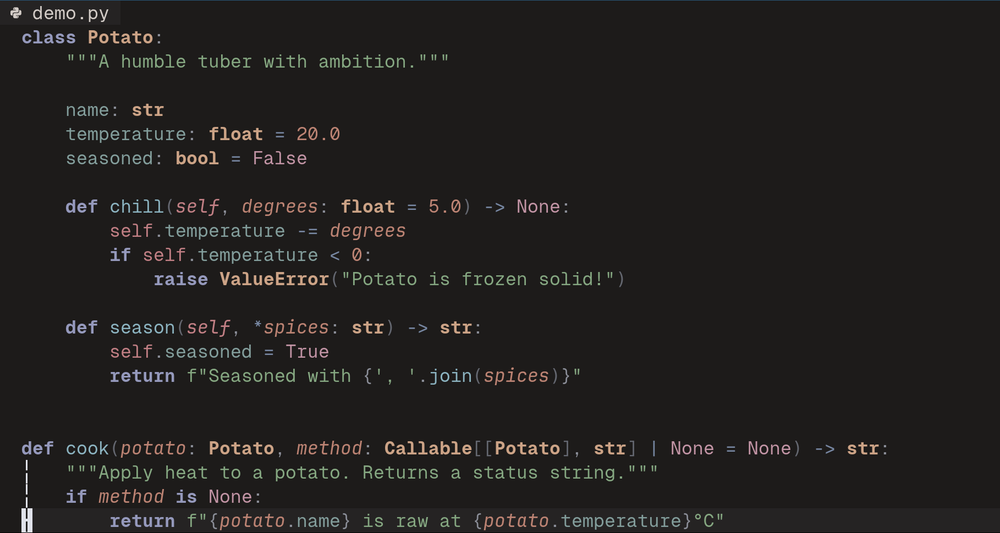

# chilling-potato 🥔❄️

A warm-grounded dark Neovim colorscheme built in the perceptually uniform
[HSLuv](https://www.hsluv.org/) color space.



## Design

All accent colors satisfy a set of explicit, measurable constraints:

- **Adjacency separation** — tokens that appear next to each other in code are separated by ≥30° in hue
- **Luminance hierarchy** — visual weight matches code scanning patterns (functions brightest, operators dimmest)
- **AAA contrast** — foreground hits WCAG AAA (10.7:1) against the warm charcoal background
- **Saturation ceiling** — no accent exceeds 40% saturation, avoiding chromatic aberration
- **Temperature cycle** — palette alternates warm → cool → warm to prevent cone fatigue

Full rationale: [RATIONALE.md](RATIONALE.md)

## Installation

### lazy.nvim

```lua
{
  "theBestPatate/chilling_potato",
  lazy = false,
  priority = 1000,
  opts = {
    -- see Configuration below
  },
}
```

### vim.pack.add (Neovim ≥0.11 built-in)

```lua
vim.pack.add({ "https://github.com/theBestPatate/chilling_potato" })
vim.cmd.colorscheme("chilling-potato")
```

### packer.nvim

```lua
use {
  "theBestPatate/chilling_potato",
  config = function()
    require("chilling_potato").setup()
    vim.cmd.colorscheme("chilling-potato")
  end,
}
```

### vim-plug

```vim
Plug 'theBestPatate/chilling_potato'
" Then in your config:
lua << EOF
  require("chilling_potato").setup()
  vim.cmd.colorscheme("chilling-potato")
EOF
```

## Configuration

Call `setup()` before `colorscheme` to customize styles:

```lua
require("chilling_potato").setup({
  transparent = false,       -- transparent background
  styles = {
    comments    = { "italic" },
    keywords    = { "bold" },
    functions   = {},
    strings     = {},
    variables   = {},
    numbers     = {},
    constants   = {},
    types       = { "bold" },
    operators   = {},
    properties  = {},
  },
  lsp_styles = {
    virtual_text = {
      errors      = { "italic" },
      warnings    = { "italic" },
      information = { "italic" },
      hints       = { "italic" },
      ok          = { "italic" },
    },
    underlines = {
      errors      = { "undercurl" },
      warnings    = { "underdashed" },
      information = { "underdotted" },
      hints       = { "underdotted" },
      ok          = {},
    },
  },
  highlight_overrides = {},  -- custom highlight group overrides
})
```

### Overriding highlight groups

```lua
require("chilling_potato").setup({
  highlight_overrides = {
    all = {
      ["@comment"] = { fg = "#ff0000", style = { "bold" } },
    },
  },
})
```

Or use the shorthand (for backward compatibility):

```lua
require("chilling_potato").setup({
  custom_highlights = {
    ["@comment"] = { fg = "#ff0000" },
  },
})
```

## Commands

- `:ChillingPotatoCompile` — manually recompile the bytecode cache (useful after config changes)

## Requirements

- Neovim ≥ 0.10 (uses `@` treesitter groups and `vim.pack.add`)
- `termguicolors` enabled (set automatically on load)

## Credits

Palette computed with HSLuv transforms and adjacency analysis against real
treesitter parse trees.

## License

GPLV3 — see [LICENSE](LICENSE)
